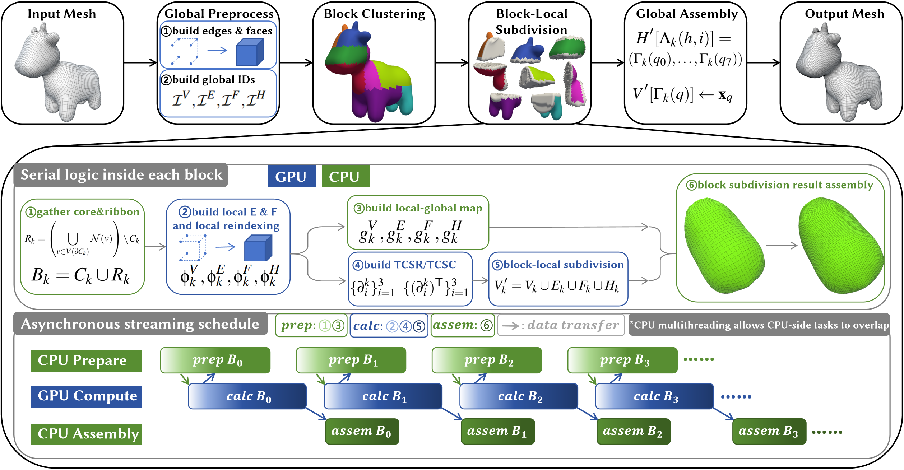

# Locality-Aware Block-Parallel GPU Subdivision

Official implementation of “Locality-Aware Block-Parallel GPU Subdivision for Large Hexahedral Meshes.”

  

  Overview of the proposed locality-aware block-parallel subdivision pipeline.

## Status

The source code and documentation are currently being prepared and will be released here upon publication.
